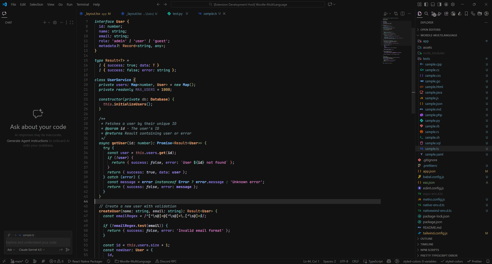
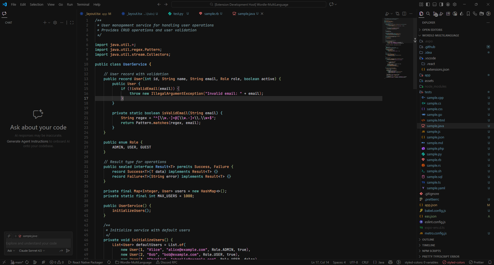
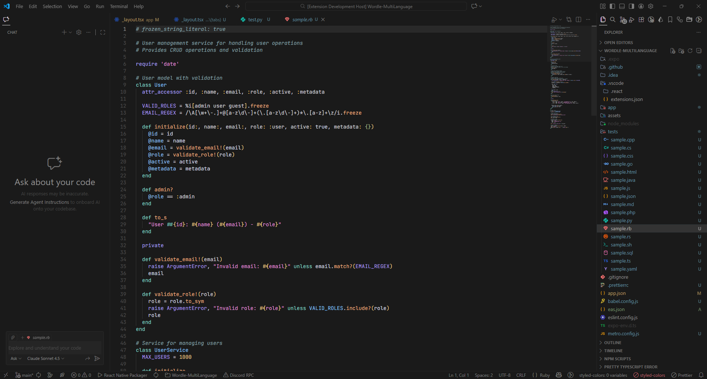

# ShadowLine Theme

**A refined, distraction-free dark theme designed for focused coding.**

ShadowLine delivers a seamless visual experience across your entire VS Code workspace. With carefully crafted colors and thoughtful typography, every element works together to keep you in the zone.

---

## ✨ Features

### 🎨 Unified Workspace Colors
Say goodbye to jarring color inconsistencies. ShadowLine harmonizes colors across:
- **Editor** — Clean, balanced syntax highlighting
- **AI Chat & Copilot panels** — Integrated seamlessly with your workspace
- **Terminal** — Muted tones that match your coding environment
- **Sidebar, tabs, and panels** — Consistent dark aesthetic throughout

### 📖 Enhanced Readability
Typography that helps you scan code faster:
- *Italic keywords* — `import`, `export`, `async`, `await`, `function`, `const`, `let` stand out naturally
- **Bold variable declarations** — Quickly identify variables inside brackets and destructuring patterns
- Thoughtfully muted UI elements so your code takes center stage

### 🌐 Language Support
Optimized syntax highlighting for:
- `JavaScript` / `TypeScript` / `TSX` / `JSX`
- `Python`, `Rust`, `Go`, `C++`, `C`
- `HTML`, `CSS`, `JSON`, `Markdown`
- And many more...

---

## 🎯 Why ShadowLine?

| Benefit | Description |
|---------|-------------|
| **Clarity** | Distinct visual hierarchy between keywords, variables, and values |
| **Focus** | Muted UI keeps attention on your code, not the interface |
| **Consistency** | Every panel, widget, and terminal shares the same aesthetic |
| **Comfort** | Carefully chosen contrast for extended coding sessions |

---

## 📦 Theme Variants

ShadowLine comes in **4 variants** to match your preference:

| Theme | Background | Font Styles |
|-------|------------|-------------|
| **ShadowLine** | `#121212` | Italic keywords, bold variables |
| **ShadowLine No Styles** | `#121212` | No italic/bold |
| **ShadowLine Less Dark** | `#1A1A1A` | Italic keywords, bold variables |
| **ShadowLine Less Dark No Styles** | `#1A1A1A` | No italic/bold |

---

## 🚀 Getting Started

### Installation

1. Open **VS Code**
2. Go to the **Extensions** view (`Ctrl+Shift+X` / `Cmd+Shift+X`)
3. Search for `ShadowLine`
4. Click **Install**
5. Open the Command Palette (`Ctrl+K Ctrl+T` / `Cmd+K Cmd+T`)
6. Select your preferred **ShadowLine** variant

### Manual Installation

```bash
# Clone the repository
git clone https://github.com/ByGONCA/ShadowLine-Theme.git

# Copy to VS Code extensions folder
# Windows: %USERPROFILE%\.vscode\extensions
# macOS/Linux: ~/.vscode/extensions
```

---

## 🖼️ Preview

### ShadowLine Dark
The darkest variant (`#121212` background) with italic keywords and bold variables:



### ShadowLine Dark No Styles
Same dark background without font styling:



### ShadowLine Less Dark
Slightly lighter background (`#1A1A1A`) with font styles:


### ShadowLine Less Dark No Styles
Lighter background without font styling:



---

## 🎨 Color Palette

ShadowLine uses a carefully curated color palette designed for maximum readability and minimal eye strain.

### Core UI Colors

| Element | Color | Hex Code | Usage |
|---------|-------|----------|-------|
| **Background** |  | `#121212` | Main editor background (dark variant) |
| **Background (Less Dark)** |  | `#1A1A1A` | Main editor background (less dark variant) |
| **Foreground** |  | `#D8DEE9` | Primary text color |
| **Selection** |  | `#404040` | Selected text background |
| **Line Highlight** |  | `#292929` | Current line background |
| **Cursor** |  | `#B0B0B0` | Cursor color |
| **Line Numbers** |  | `#505050` | Inactive line numbers |
| **Active Line Number** |  | `#909090` | Active line number |

### Syntax Colors

| Token Type | Color | Hex Code | Examples |
|------------|-------|----------|----------|
| **Keywords** |  | `#82D2CE` | `import`, `export`, `async`, `await`, `function` |
| **Control Keywords** |  | `#A8CC7C` | `if`, `else`, `for`, `while`, `return` |
| **Variables** |  | `#D1D1D1` | Variable names |
| **Properties** |  | `#AA9BF5` | Object properties, class members |
| **Functions (Calls)** |  | `#EBC88D` | Function invocations |
| **Functions (Declarations)** |  | `#EFB080` | Function definitions (bold) |
| **Strings** |  | `#A8CC7C` | String literals |
| **Numbers** |  | `#D1D1D1` | Numeric values |
| **Comments** |  | `#505050` | Code comments (muted) |
| **Types/Classes** |  | `#87C3FF` | Type names, class names |
| **Constants** |  | `#82D2CE` | `true`, `false`, `null`, `undefined` |
| **Operators** |  | `#D6D6DD` | `+`, `-`, `*`, `/`, `=` |

### Semantic Colors

| Element | Color | Hex Code | Purpose |
|---------|-------|----------|---------|
| **Error** |  | `#BF616A` | Error messages and indicators |
| **Warning** |  | `#EBCB8B` | Warning messages |
| **Success/Added** |  | `#A3BE8C` | Git additions, success states |
| **Modified** |  | `#B89A60` | Git modifications |
| **Info** |  | `#88C0D0` | Info messages, find matches |

### Design Philosophy

The ShadowLine color palette follows these principles:

- **Low Contrast UI**: Muted grays (`#505050` - `#909090`) for UI elements keep focus on code
- **High Contrast Syntax**: Carefully chosen colors ensure keywords and values stand out
- **Semantic Grouping**: Similar language constructs share color families
  - Keywords/Built-ins: Cyan/Teal shades (`#82D2CE`)
  - Strings/Literals: Green shades (`#A8CC7C`)
  - Functions: Warm oranges (`#EBC88D`, `#EFB080`)
  - Types: Sky blue (`#87C3FF`)
  - Properties: Purple (`#AA9BF5`)
- **Visual Hierarchy**: Font styles (italic, bold) combined with color create clear distinction
- **Accessibility**: All color combinations meet WCAG contrast requirements for readability

---

## 💡 Recommended Settings

For the best experience, consider these VS Code settings:

```json
{
  "editor.fontFamily": "'JetBrains Mono', 'Fira Code', Consolas, monospace",
  "editor.fontLigatures": true,
  "editor.fontSize": 14,
  "editor.lineHeight": 1.6
}
```

---

## 🤝 Contributing

Found an issue or have a suggestion? Feel free to open an issue or pull request on [GitHub](https://github.com/ByGONCA/ShadowLine-Theme).

---

## 📄 License

MIT © [ByGONCA](https://github.com/ByGONCA)

---

**Enjoy coding in the shadows.** 🌑
